> ⚠️ **QUÉ ES ESTE FICHERO (nota añadida ago-2026).**
>
> Son **apuntes de estudio sobre literatura externa** — principalmente el trabajo de Liao
> et al. (Nature Machine Intelligence, 2024) sobre ML-QEM. **No describen este TFM**, y esa
> distinción importa al redactar la memoria.
>
> **La diferencia clave:** lo que se describe aquí es mitigación **en tiempo de ejecución** —
> el modelo recibe el valor ruidoso ya medido y lo corrige. **Este TFM opera antes de
> ejecutar**: la entrada del modelo es solo el circuito y la calibración del chip, nunca el
> resultado. Ese es precisamente el hueco que el trabajo ataca.
>
> **Cómo usarlo:** como fuente para el capítulo 4 (Estado del arte), citando a los autores
> originales. **Nada de aquí es un resultado propio.** Los resultados propios están en
> `memoria/materiales.md`.
>
> ⚠️ Las cifras que aparecen abajo son **de los papers**, no medidas por nosotros. Etiquetar
> como `[EXTERNO]` cualquiera que se lleve a la memoria.

---

# Pipeline de Introducción

## 1. Introducción general de los ordenadores cúanticos. Era NISQ.

## 2. QEM
- Explicar QEM y QEC
- Nombrar el método de QEC más importante, --> Surface, y crear los dibujos chulos de por cada quibit real se necesitan cientos lógicos.
- Hacer referencia de los métodos más importantes de QEM --> PEC y ZNE. Ver ambos enfoques y ver cómo de mal funcionan (para que en el siguiente apartado centrarnos en lo útil que es el método de Machine Learning)

## 3. Machine Learning methods accelerate QEM at runtime
El objetivo de los métodos basados en Machine Learning no es modelar explícitamente el ruido cuántico —como hacen los métodos probabilísticos clásicos (PEC, PEA)— sino producir correcciones rápidas y eficientes durante la ejecución del circuito.
Por ello, las preguntas relevantes no son “qué tan bien aprenden el ruido”, sino:

- **¿Cómo de bien generalizan bajo ruido real de hardware?**  
(robustez frente a drift, fluctuaciones y ruido no modelado)

- **¿Qué tan eficientes son en tiempo de ejecución?**  
(latencia, coste computacional, reducción de shots)

- **¿En qué escenarios aportan ventajas claras?**  
(circuitos profundos, ruido correlacionado, hardware con drift rápido, QAOA, VQE…)

## 4. Flujo de trabajo de ML-QEM

### **4.1. Generación de los datos de entrenamiento**
Generamos una gran cantidad de circuitos de entrenamiento que simulan la estructura del circuito de interés --> Pasamos esos circuitos al codificador para obtener sus características, como el número de compuertas --> Pasamos por la QPU para obtener los valores esperados con ruido. 
- Si estos circuitos de entrenamiento son de pequeña escala, se pueden pasar por el simulador de ruido para obtener los valores esperados ideales, y establecemos eso como el valor esperado objetivo. 
- De lo contrario, podemos obtener el valor esperado mitigado por otro método de mitigación de errores y establecerlo como el objetivo.

  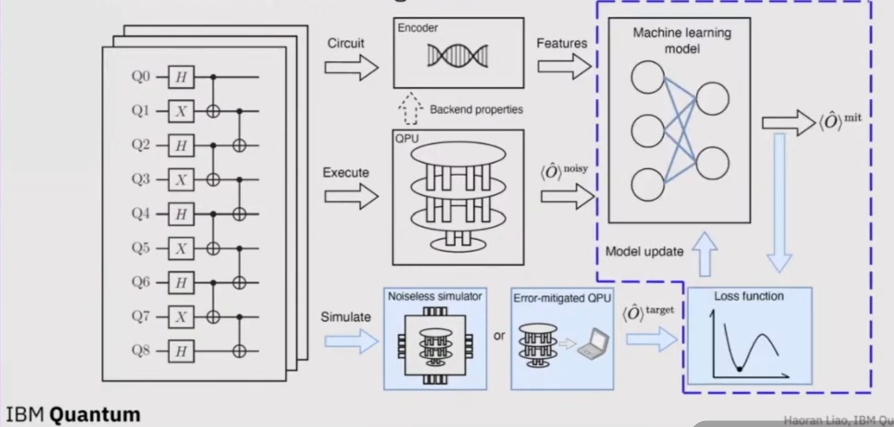

### **4.2. Entrenamiento del modelo de machine learning**

Entrenar el modelo de aprendizaje automático para que realice una regresión de las características a nivel de circuito y los valores esperados con ruido sobre el objetivo. Si el modelo de aprendizaje automático requiere de una actualización iterativa, entonces la salida y cada iteración se introducen en la función de pérdida junto con el valor esperado objetivo, y el optimizador intentará minimizar la función de pérdida en duración directa actualizando los parámetros del modelo.

El modelo se considerará completo cuando la función de pérdida converja a algún mínimo.

### **4.3. Mitigar valores esperados ruidosos en tiempo de ejecución**

Después del entrenamiento, en el tiempo de ejecución, todo lo que necesitamos hacer es pasar el circuito de interés al codificador nuevamente para obtener los las características a nivel de circuito y lo pasamos a través de la QPU para obtener los valores ruidosos esperados. Y luego podemos alimentar con todos ellos al modelo de aprendizaje automático entrenado para obtener el valor mitigado esperado.

*NOTA: Con este método NO hay circuitos de mitigación adicionales necesarios en tiempo de ejecución --> Así alcanzamos la eficiencia durante el tiempo de ejecución.*

  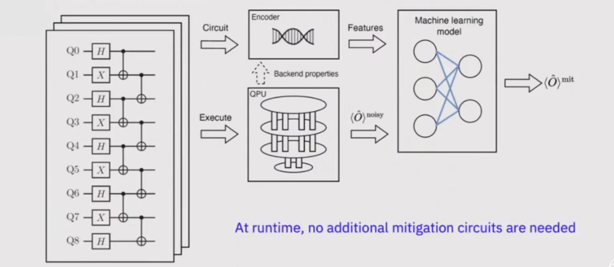

## 5. Comparativa frente a métodos de ML previos

*Aquí conviene realizar la comparativa con nuestro enfoque propio frente al que destaquemos*

Diferencias entre el método del vídeo frente al enfoque de aprendizaje automático anterior llamado **Clifford data regression (CDR)**:

- Diferencia 1: CDR recopila circuitos mayoritariamente compuestos por puertas Clifford para el entrenamiento (*largely-Cliffordized circuits*); sin embargo, en el método del vídeo no se tiene esa restricción. Lo que se pregunta es si existe una similitud entre los circuitos de entrenamiento y los circuitos de testeo (de interés???).

*NOTA: "largely-Cliffordized circuits" es una expresión que se usa para describir circuitos que imitan la estructura del circuito objetivo, pero donde la mayoría de las puertas no son arbitrarias, sino Clifford, porque los circuitos Clifford permiten simulación eficiente y etiquetado limpio para entrenamiento. Es decir, son circuitos diseñados para ser parecidos al circuito real, pero más fáciles de simular y útiles para generar datos de entrenamiento (por ejemplo, para modelos ML de mitigación).*

- Diferencia 2: CDR no trabaja con caracteristicas a nivel de circuito, luego no tiene el componente del codificador.

- Diferencia 3: CDR emplea solamente la regresión lineal como modelo para la mitigación

## 6. Comparativa el funcionamiento de diferentes modelos de ML

- Ordinary least square (OLS): El input a este modelo lineal es un vector que consiste de valores ruidosos, de características de nivel de circuito como recuentos G, y también observables codificados. Se usa la codificación polinómica dispersa, donde habrá unos y ceros en esas entradas que servirán como variables indicadoras para la regresión lineal.

- Random Forest regression (RF): Se alimenta con la misma entrada que el OLS. Cada árbol de decisión del RF trabaja con un subconjunto bootstrap de los ejemplos del conjunto de entrenamiento de entrada y así como algunas características. Por ejemplo, la división de primer nivel en el árbol 1 se basa en los valores de expectativa ruidosos, si es mayor que 0.5 vamos a la derecha en el siguiente nivel de división y si es lo contrario a la izquierda. El RF promediará todas las decisión finales de cada árbol.

- Multi-layer perception (MLP): Es el modelo neuronal más simple que podemos emplear. Se alimenta con la misma entrada. MLP se puede pensar como capas sucesiva de regresiones lineales seguidas de funciones de activación no lineales.

- Graph neural network (GNN): En el modelo más complicado de todos. Este modelo es bueno para extraer relaciones interdependientes entre nodos en un grafo y también es bueno para extraer información global de un grafo. 

***NOTA: Los circuitos cuánticos se pueden representar naturalmente como un grafo acíclico donde el nodo representa alguna operaciones o puertas y las aristas en el grafo representan los qubits.***

  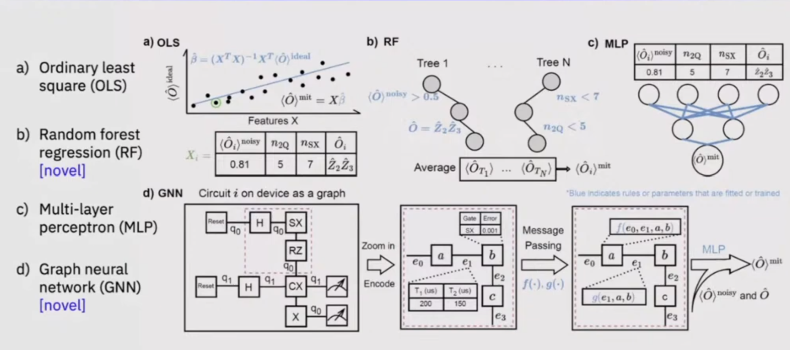

## 7. Resultados clave

*Aquí conviene nuestros resultados*

En el video se dice que el modelo RF es el mejor. Funciona mejor en circuitos a escala pequeña y mejora la eficiencia a gran escala también de manera significativa.

## 8. Resultados generales

Minuto 22:00

  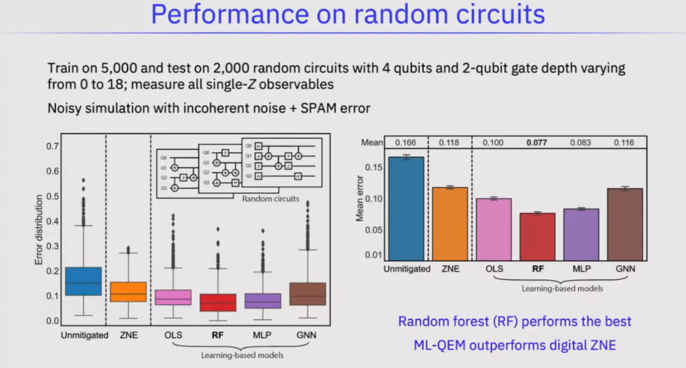

## 9. Prueba con circuitos Trotterized 

Se prueba el modelo aprendido en este cicruito particular que tiene ruido distinto y en general una estructura diferente.

  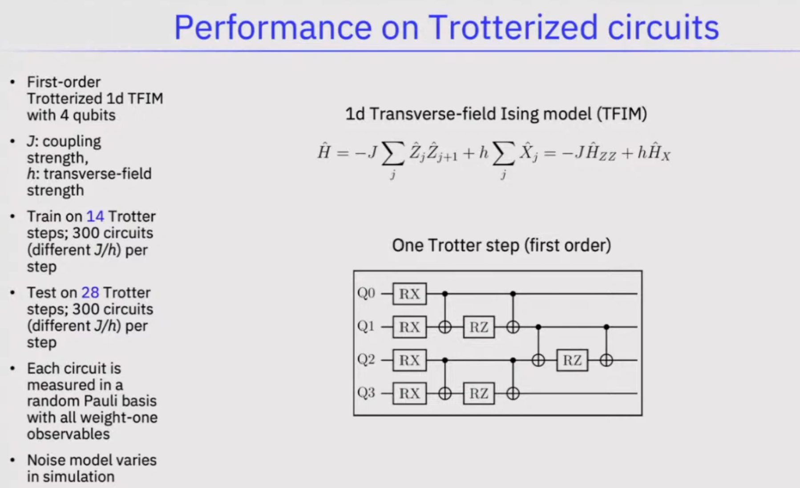

### Datos en circuito artificial (minuto 26:00)

  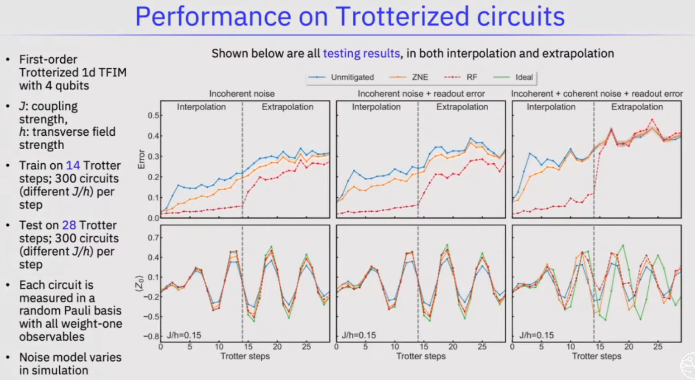

- Columna 1: Ruido incoherente

- Columna 2: Ruido incoherente + Readout error

- Columna 3: Ruido incoherente + Ruido coherente + Readout error

### Datos en hardware real

  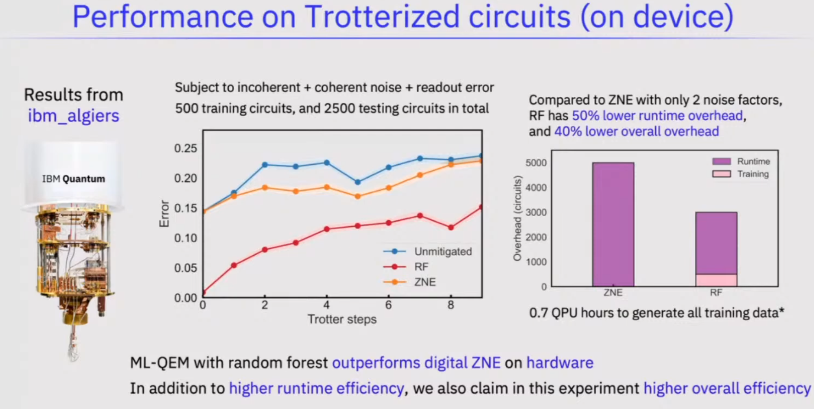

## 10. Los 3 tipos de errores

### **10.1. Ruido incoherente (Incoherent Noise)**  
**Qué es:**  
Ruido **aleatorio**, impredecible, que cambia cada vez que ejecutas el circuito.  
No sigue un patrón. No se acumula de forma ordenada.

**Ejemplo sencillo:**  
Como si cada vez que lanzas una moneda, el viento soplara distinto.  
En cuántica:  
- el qubit pierde fase por vibraciones del entorno  
- fluctuaciones térmicas  
- despolarización aleatoria  

**Idea clave:**  
Es “ruido de fondo”. No puedes corregirlo calibrando porque no es estable.

### **10.2. Error de lectura (Readout Error)**  
**Qué es:**  
Error que ocurre **al medir** el qubit.  
El hardware confunde el resultado.

**Ejemplo sencillo:**  
El detector dice “1” cuando el qubit era “0”, o al revés.  
Como una cámara borrosa que a veces confunde un gato con un perro.

**Idea clave:**  
No afecta al cálculo, solo a la **medición final**.

### **10.3. Ruido coherente (Coherent Noise)**  
**Qué es:**  
Ruido **sistemático**, **predecible**, que se acumula siempre igual.  
Es un error “ordenado”, no aleatorio.

**Ejemplo sencillo:**  
Una puerta que debería rotar el qubit 90° pero siempre rota 92°.  
Ese error se repite en cada uso → se acumula.

Otros ejemplos:  
- mala calibración de la frecuencia del qubit  
- pulsos de control siempre un poco más fuertes  
- drift estable en el tiempo  

**Idea clave:**  
Es como un error de calibración en una máquina: siempre el mismo, siempre empuja en la misma dirección.

### ¿Por qué el autor usa ese orden en las gráficas?

Porque quiere mostrar **paso a paso** cómo empeora el rendimiento:

1. **Solo ruido incoherente**  
   → el caso más simple, el “mínimo ruido inevitable”.

2. **Incoherente + error de lectura**  
   → añade el ruido que aparece al medir.

3. **Incoherente + coherente + lectura**  
   → el caso **realista** del hardware cuántico.

Si empezara por el ruido coherente, no verías qué parte del error viene de dónde.  
El orden es **de más simple a más realista**.

## 11. Adaptación al noise drift del dispositivo

  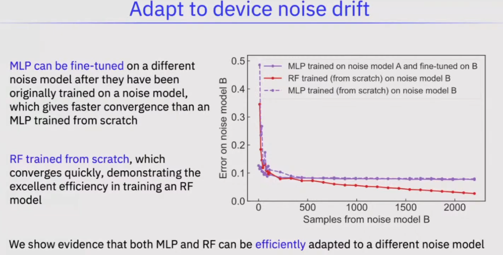

En la práctica, el ruido en el dispositivo a menudo derivará con el tiempo y eso puede incurrir frecuentemente en una sobrecarga de entrenamiento. Por lo que no estamos seguros de si el modelo de ML puede generalizar el noise-drifting, sigue siendo una cuestión abierta. Sin embargo, incluso aunque no generalice a un ruido de deriva (noise-drift), se muestra que aún pueden adaptarse eficientemente a un nuevo modelo de ruido.

## 12. Caso de uso 1: Mitigación de observables de Pauli NO vistos en entrenamiento

Los **observables de Pauli** son, básicamente, las tres mediciones fundamentales que puedes hacer sobre un qubit. Son tan importantes que prácticamente toda la computación cuántica se construye a partir de ellos.

¿Por qué son tan importantes?

- cualquier observable de un qubit se puede escribir como combinación de X, Y y Z

- cualquier Hamiltoniano de un qubit se descompone en términos de Pauli

- <u> cualquier circuito cuántico se puede analizar midiendo estos observables </u>

- en mitigación de ruido, se predicen expectation values de estos observables

Son como los ejes X, Y, Z en geometría: todo se construye a partir de ellos.

  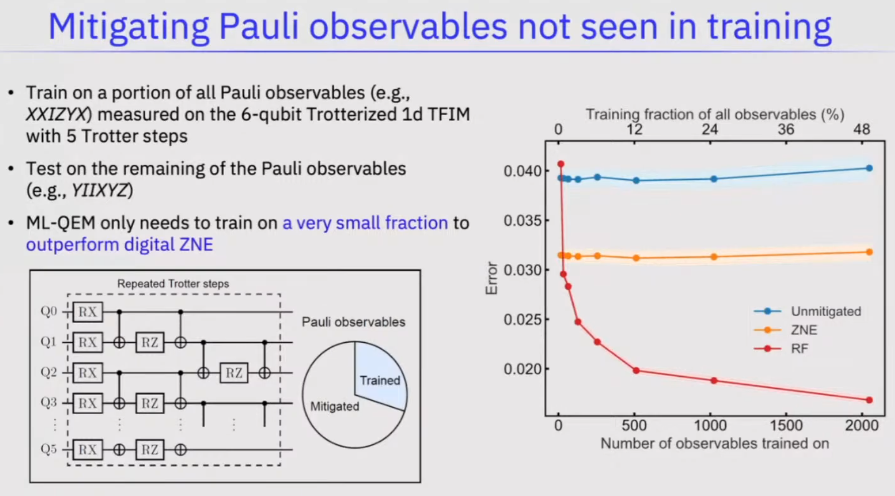

Se empleó  un subconjunto de observables de Puali para entrenar el modelo y se pidió que mitigara el resto de valores esperados.

 ## 13. Caso de uso 2: Mejorar los algoritmos variacionales (por ejemplo, VQE)

Los algoritmos variacionales (como VQE, Variational Quantum Eigensolver) son algoritmos híbridos cuántico‑clásicos que:

- usan un circuito cuántico parametrizado

- ajustan esos parámetros con un optimizador clásico

- buscan minimizar un valor esperado (energía, coste, etc.)

Pero estos algoritmos sufren muchísimo por el ruido cuántico.

VQE es el algoritmo variacional más usado, extremadamente sensible al ruido --> un candidato ideal para ser “mejorado” con ML o QEM.

  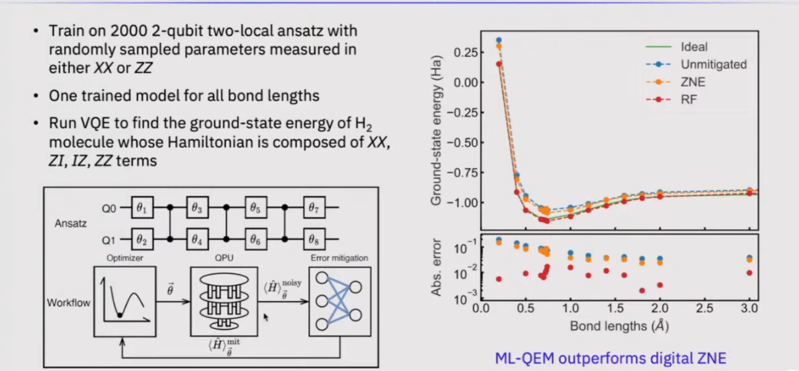

Se emplean el mititgador de error a los datos antes de que pasen por el optimizador.

## 14. Escalabilidad mediante imitación

  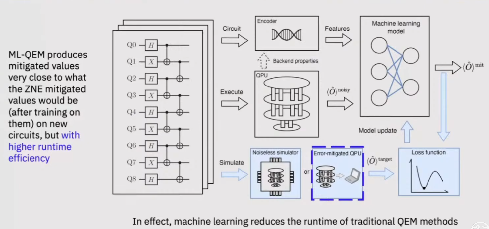

 
Demostración: 

  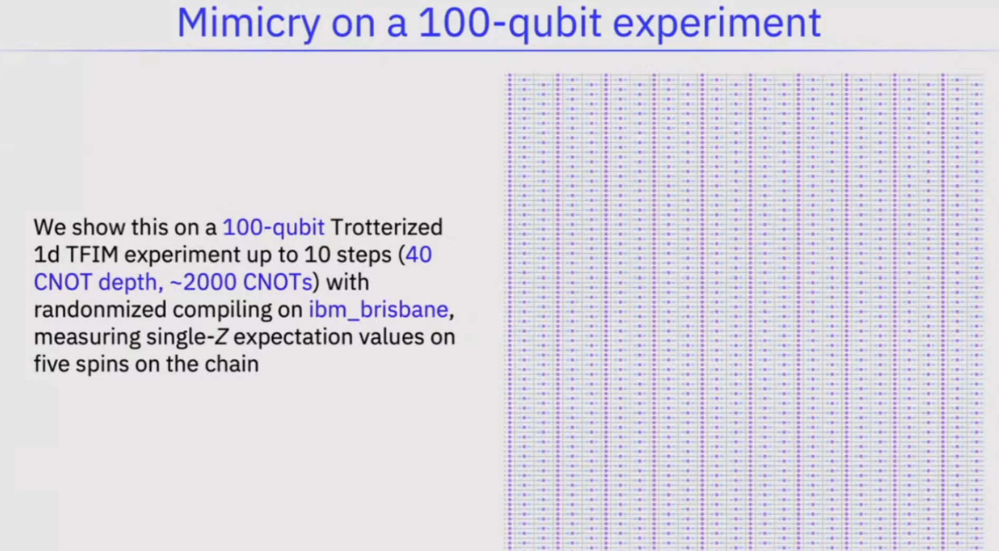

Para demostrar que nuestro modelo escala gracias a la imitación (mimicry), lo probamos en un experimento real de 100 qubits en el chip IBM Brisbane. Ejecutamos un circuito grande (TFIM trotterizado, 2000 CNOTs), aplicamos randomized compiling, y medimos valores esperados de Z en 5 qubits. El modelo consigue imitar el comportamiento del hardware incluso en este escenario grande y ruidoso.

  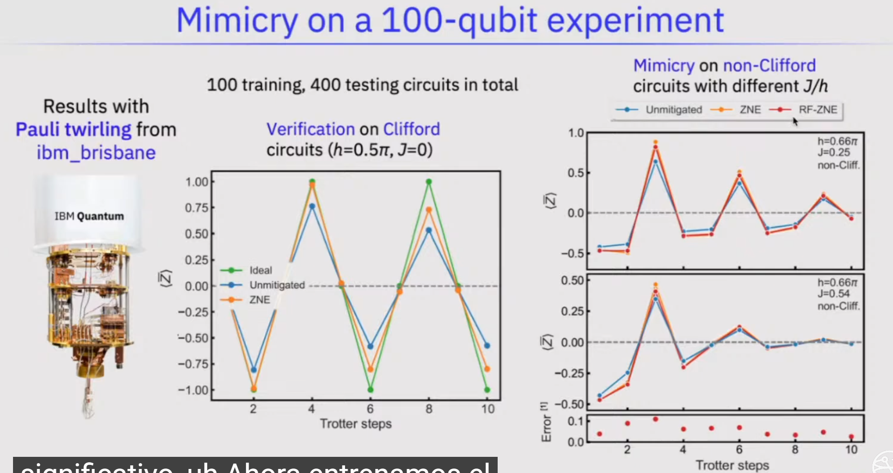

**Pauli twirling** es una técnica que convierte ruido coherente (sistemático y peligroso) en ruido incoherente (aleatorio y manejable) aplicando operaciones de Pauli aleatorias antes y después de las puertas.

  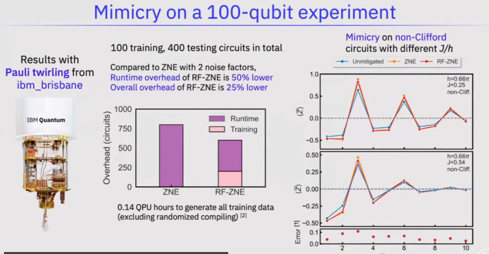

## 14. Conclusión

1. Usando un marco general para el enfoque de **QEM basado en aprendizaje automático (ML‑QEM)**, ampliamos y analizamos un amplio espectro de modelos de aprendizaje automático, desde los simples hasta los complejos.  
   – La **regresión con bosques aleatorios (random forest regression)** supera de forma consistente a otros modelos.

2. En simulaciones clásicas con ruido, **ML‑QEM** supera de manera significativa y consistente al **ZNE digital**, con menor coste adicional (*overhead*) en una variedad de configuraciones y tareas:  
   a) bajo distintos modelos de ruido (error de lectura, incoherente, coherente)  
   b) en estructuras de circuito en los dos extremos (aleatorio y trotterizado)  
   c) en extrapolaciones cuando no hay error coherente  
   d) mitigando observables de Pauli no vistos durante el entrenamiento  
   e) mitigando algoritmos variacionales, por ejemplo, **VQE**

3. En experimentos, **ML‑QEM** mejora significativamente:  
   a) tanto la **precisión** como la **eficiencia** respecto al ZNE digital en circuitos de pequeña escala  
   b) la **eficiencia** de los métodos QEM existentes en circuitos de gran escala

## 15. Algunas direcciones futuras

1. Cuando se entrena con diferentes parámetros de ruido y sus correspondientes valores esperados ruidosos, ¿podemos establecer todos los parámetros de ruido codificados en la **GNN** en los valores “buenos” (es decir, *establecer el error de puerta codificado en 0, los tiempos de coherencia en infinito*) para predecir los valores esperados ideales **sin necesidad de entrenar nunca con valores esperados ideales (y por tanto, de forma escalable)**?

2. ¿Podemos, en cambio, ajustar (regress) los valores esperados ideales y ruidosos de circuitos de pequeña escala respecto a los parámetros de ruido **para extraer algunos parámetros de ruido** (por ejemplo, el **error medio de puerta de dos qubits**) del backend, **sin ejecutar experimentos de benchmarking adicionales con recursos cuánticos extra**?

3. En **ML‑QEM**, el conjunto de entrenamiento puede optimizarse tanto en tamaño como en tipo de circuitos de entrenamiento, siguiendo principios de diseño.

4. **ML‑QEM** puede ser evaluado de forma más rigurosa frente a métodos líderes, como **PEC**, **PEA** y **pulse‑stretching ZNE**.